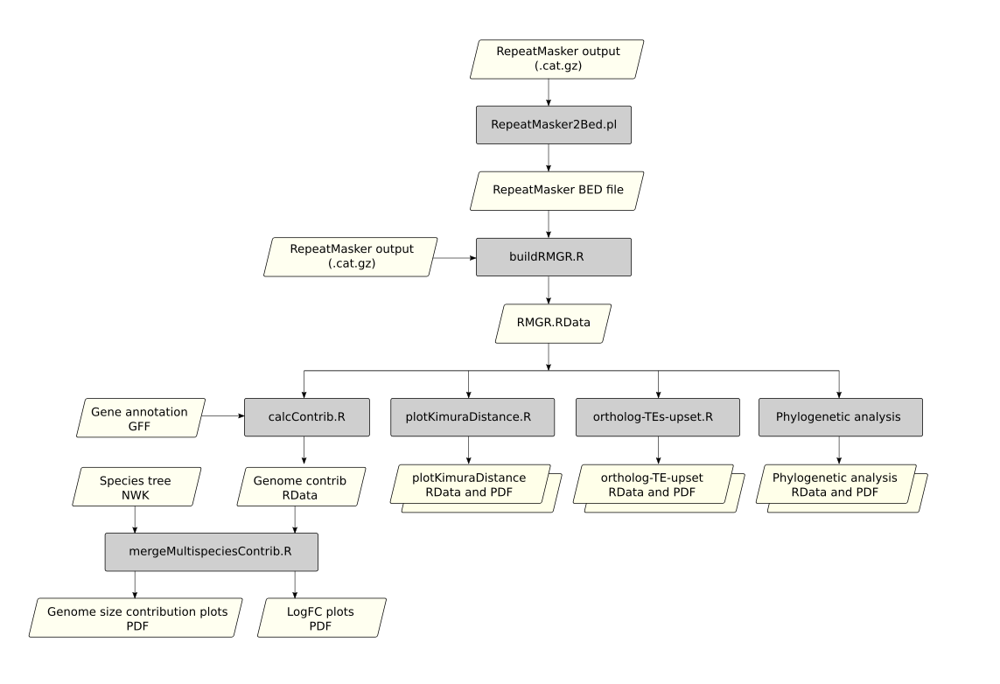

# TE workflows: Snakemake workflows for analyzing TEs in genomic data

This repository contains several workflows used primarly to analyze the different aspects of transposable elements (TEs) biology in the genomes of several species of killifish. However, in principle it should work for any other eukaryote species.

## Overview

In general terms, the workflow is able to:

+ Quantify the abundance of TEs in genomes at different levels of classification (TE orders and superfamilies).
+ Generate distributions of Kimura distances.
+ Calculate the degree of fold-enrichment for specific TE superfamilies between species.
+ Infer phylogenetic relationships between representative sequences of TE superfamilies.
+ To perfom analysis of shared and unique TE superfamilies between species.
+ To characterize TE superfamilies insertions regarding to gene regions (exons, introns, upstream, and downstream)
+ To identify genes with tandem repeats of specific TE superfamilies.

## Modules

The complete workflow is divided into modules whose input and output files are summarized in the following flow diagram:

## Requirements

(Note that this section is still under development)
The requirements will vary according to the module used, however there are a few mandatory requeriments:

_Mandatory_
+ Docker
+ [This container](https://hub.docker.com/r/fgajardoe/r-custom)
+ Bedtools

_For Tandem analysis_
+ TRF

_For phylogenetic analysis_
+ RAxML

# References

Gajardo et al., _(In preparation)_ A recent and rapid genome expansion driven by the amplification of transposable elements in the annual killifish 
Austrolebias charrua.

Morales et al., _(In preparation)_ Genomic insights of the fish genus Orestias from 	the Andean Altiplano shed light on its evolutionary history and its phylogenetic placement within the Cyprinodontiformes order. 
